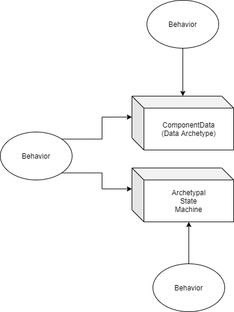

# Component Architecture

## Overview

The goal of this phase of development is to build something which is structured in a way that is easily transferrable to ECS.  My POV is

* ECS, as an archetectural strategy, is very clear.
* ECS provides enormous "out of the box" performance benefits over a near-identical Monobehavior system by using data organizational strategies which let us take full advantage of hardware.
* ECS is where Unity is going, judging from the numerous talks given about it by the team.
* ECS is, at present, in a very early stage of development in Unity.

It thus makes sense that we should set ourselves up for a long-term strategy which includes ECS without hampering current development by grappling with underdeveloped and production-unready systems.  We will thus use a near-term architectural strategy that we believe is easily portable to an ECS architecture while allowing us to leverage the more mature systems which are in Unity today.

## ECS Concepts

I'm not going to get in to too much detail here, but the general concepts are

* Entities are IDs
* All state related to a particular entity is stored within Components.  Any number of components can be associated with a particular entity.
* Components which contain related and/or frequently grouped data (transform and rotation information, for example) can be considered a Component Archetype.
* Systems read and transform Components to put in to effect gameplay.

## Architectural Goals for the Foreseeable Future

We'll organize our data in to ComponentData components which will represent a particular archetype (effectively mocking out the return of any common ECS component query we'd expect to see).  All MonoBehaviors will emulate systems (operating atomically on individual components instead of the queried group).  A subset of ComponentData will be a state machine - this is not easily translatable to an ECS architecture (it'll have to be broken up in to several tiny components) but for cleanliness sake right now we'll just use this and we can approach the refactoring problem when we get to it.